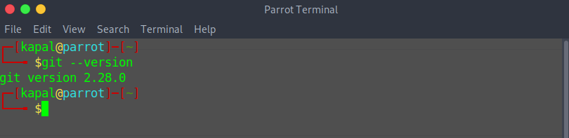
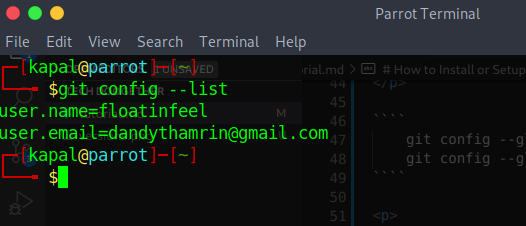

# How to Install or Setup and Initialize Git in any Project with Markdown Format. 

If the readers is not familiar with **_command line_**, readers can use       [GitHub Desktop](https://desktop.github.com)  to create and manage a git repository without using the command line.

- ## Installation and Setting up Git
<p> This `step` will be devided in to Two parts: </p>

1. How to install Git on Linux.
2. Initial Configuration After Installing Git.

    - ##### How to Install Git on Linux

    <p> The first thing that readers need to do is open the terminal for download the git package by writing this code down below: </p>

    ````
        sudo apt install git
    ````
    <p> or, readers can use another way as down below: </p> 

    ````
        sudo apt-get install git
    ````

    <p> After that, try checking the installed version with the command:</p>

    ```
        git --version
    ```
    <p> as readers can see, if there is a detail version in the terminal, it mean that git has successfully installed on the computer. </p>

    

    - ##### Initial Configuration Github Account

        <p>
            There are several configurations that need to be prepared before starting using git, such as name and email.
        </p>

        <p>
            Please do the configuration with the following command.
        </p>

        ````
            git config --global user.name "dandihusni"
            git config --global user.email dandythamrin@gmail.com
        ````

        <p>
            Then check the configuration with the command:
        </p>

        ````
            git config --list
        ````

        <p>
            If it looks like the following picture, it means the configuration is successful.
        </p>

        

        <p> After readers has successfully install and config github, then the next step is initialize git in any git project repository.</p>
    
- ## Initialize git in any git project repository

    - ##### Initialize git repository

    <p>Initialize git in repository can be done by the following command below:</p>

    ````
        git init directory-name
    ````
    
    <p>That command will create and initialize a directory named `directory-name`. If the directory already exists, then git will initialize it in that directory. The git init command will create a directory called .git in our project. This directory is used by git as a database to store our changes. </p>

    - ##### The other way for initialize git repository

    <p> The following command will create and initialize a repository in the current directory (working directory). 
    </p>

    ````
        git init .
    ````

    <p> A period (.) Means that git will create and initialize a repository in the current working directory. </p>


