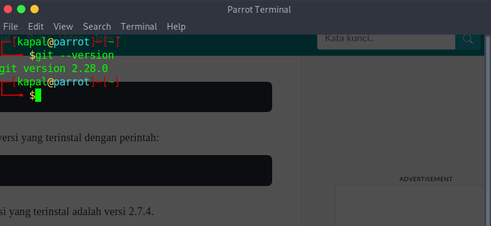

# How to Install or Setup and Initialize Git in any Project with Markdown Format. 

If the reader is not familiar with **_command line_**, reader can uses       [GitHub Desktop](https://desktop.github.com)  to create and manage a Git repository without using the command line.

- ### Installation and Setting up Git
<p> This `step` will be devided in to Two parts: </p>

1. How to install Git on Linux.
2. Initial Configuration After Installing Git.

- #### How to Install Git Linux

The way to install git on Linux are:

   - #### Install Git Package by Terminal
   <p> First, reader need to opens the terminal for download the Git package by writing this code down below: </p>

````
    
    sudo apt install git
   
````
   <p> or, reader can uses another way as down below: </p> 

````
    sudo apt-get install git

````

<p> After that, try checking the installed version with the command:</p>

```
    git --version

```
<p> as reader can see, if there is a detail version in the terminal, it mean that Git has successfully installed on the computer. </p>




